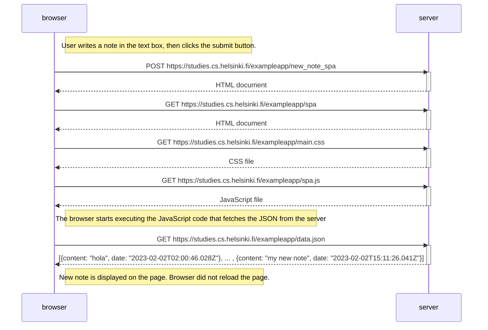

```mermaid
sequenceDiagram

    participant browser
    participant server
    
    Note right of browser: User writes a note in the text box, then clicks the submit button.
    
    browser->>server: POST https://studies.cs.helsinki.fi/exampleapp/new_note_spa
    activate server
    server-->>browser: HTML document
    deactivate server
    
    browser->>server: GET https://studies.cs.helsinki.fi/exampleapp/spa
    activate server
    server-->>browser: HTML document
    deactivate server
    
    browser->>server: GET https://studies.cs.helsinki.fi/exampleapp/main.css
    activate server
    server-->>browser: CSS file
    deactivate server
    
    browser->>server: GET https://studies.cs.helsinki.fi/exampleapp/spa.js
    activate server
    server-->>browser: JavaScript file
    deactivate server
    
    Note right of browser: The browser starts executing the JavaScript code that fetches the JSON from the server
    
    browser->>server: GET https://studies.cs.helsinki.fi/exampleapp/data.json
    activate server
    server-->>browser: [{content: "hola", date: "2023-02-02T02:00:46.028Z"}, ... , {content: "my new note", date: "2023-02-02T15:11:26.041Z"}]
    deactivate server
    
     Note right of browser: New note is displayed on the page. Browser did not reload the page.
    
```
